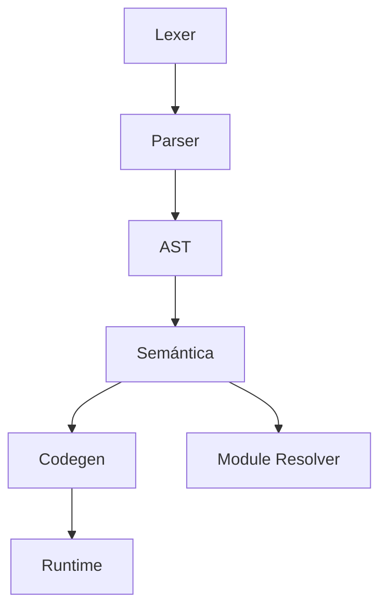

# Arquitectura del compilador `aymc`

Este documento resume los módulos principales y su flujo de compilación.

## Vista general

```mermaid
flowchart LR
    A[Fuente .aym] --> B[Lexer]
    B --> C[Parser]
    C --> D[AST]
    D --> E[Semántica]
    E --> F[Codegen NASM]
    F --> G[Ensamblador + Linker]
    G --> H[Ejecutable]
    E --> I[Codegen LLVM (opcional)]
    I --> J[IR .ll]
```

## Módulos principales

- **Lexer (`compiler/lexer`)**: tokeniza el código fuente.
- **Parser (`compiler/parser`)**: construye el AST y valida la sintaxis.
- **AST (`compiler/ast`)**: nodos de expresiones y sentencias.
- **Semántica (`compiler/semantic`)**: tipos, símbolos, clases y excepciones.
- **Codegen (`compiler/codegen`)**: genera NASM o LLVM IR.
- **Runtime (`runtime/`)**: funciones base usadas por los binarios.
- **Module resolver (`utils/module_resolver`)**: carga `apnaq` y gestiona rutas.



## Artefactos clave

- `*.asm` y `*.o`/`*.obj` para el backend NASM.
- `*.ll` para el backend LLVM (si está habilitado).
- Binario final nativo.

---

**Siguiente:** [Guía del proyecto](project.md)
