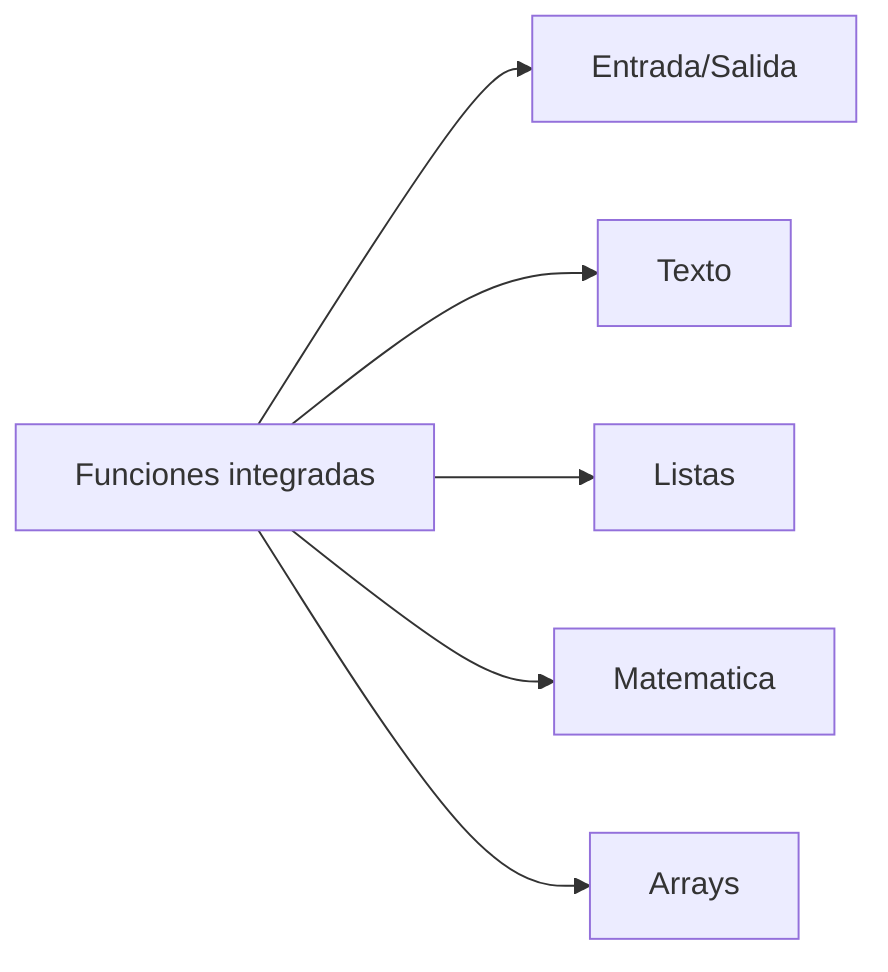

# Referencia rápida del lenguaje

Esta página resume lo esencial del lenguaje para consulta rápida. Para la
gramática formal revisa [Gramática](grammar.md).

## Tipos

- `jakhüwi` (numérico)
- `aru` (texto)
- `chiqa` (booleano)
- `t'aqa` / `listaña` (listas)
- `mapa` (mapas)

## Literales

- Booleanos: `chiqa` / `k'ari` (legacy: `utji` / `janiutji`).
- Números: decimales, `0x` (hex) y `0b` (binario).
- Cadenas: comillas simples o dobles con escapes.

## Estructuras principales

- Condicionales: `jisa` / `maysatxa`
- Bucles: `ukhakamaxa`, `taki`
- Funciones: `lurawi` / `kuttaya`
- Clases: `kasta`, `machaqa`, `aka`, `jila`, `jikxata`, `sapa`, `taqi`, `sapakasta`, `uñt'aya`, `chura`, `jilaaka`
- Excepciones: `yant'aña`, `katjaña`, `tukuyawi`, `pantja`
- Módulos: `apnaq`

## Biblioteca estándar (built-ins)

### Entrada/Salida y utilidades
- `qillqa`, `write`, `input`, `katu`, `sleep`, `random`

### Conversión y longitud
- `aru`, `jakhüwi`, `length`, `largo`, `suyu`, `suyut`, `suyum`

### Arreglos (dinámicos)
- `array`, `array_get`, `array_set`, `array_free`, `array_length`

### Texto
- `ch'usa`, `jaljta`, `mayachta`, `sikta`, `utji`, `utjisuti`, `sutinaka`, `apsusuti`

### Listas
- `push`, `ch'ullu`, `apsu`, `apsuuka`, `utjit`, `chaninaka`, `chanim`

### Matemática
- `sin`, `cos`, `tan`, `asin`, `acos`, `atan`, `sqrt`, `pow`, `exp`, `log`,
  `log10`, `floor`, `ceil`, `round`, `fabs`

---

**Siguiente:** [Manejo de errores](exceptions.md)
