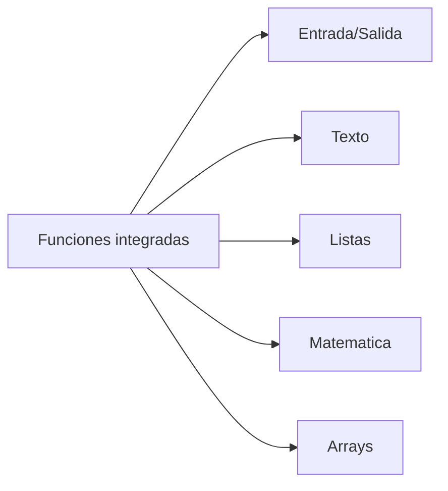

# Referencia rápida del lenguaje

Esta página resume lo esencial del lenguaje para consulta rápida. Para la
gramática formal revisa [Gramática](grammar.md).

## Tipos

- `jakhüwi` (numérico)
- `aru` (texto)
- `chiqa` (booleano)
- `t'aqa` (listas)
- `mapa` (mapas)

## Literales

- Booleanos: `chiqa` / `k'ari`.
- Números: decimales, `0x` (hex) y `0b` (binario).
- Cadenas: comillas simples o dobles con escapes.

## Estructuras principales

- Condicionales: `ukaxa` / `maysatxa`
- Bucles: `ukhakamaxa`, `kuti`
- Funciones: `lurawi` / `kuttaya`
- Enumeraciones: `siqicha`
- Selección por patrones simples: `khiti`, `kuna`, `yaqha` para `jakhüwi` y `aru`; `kuna` acepta múltiples valores separados por `,` y rangos `a..b` (en `jakhüwi`)
- Clases: `kasta`, `machaqa`, `aka`, `jila`, `sapa`, `sapakasta`, `jilaaka`
- Excepciones: `yant'aña`, `katjaña`, `tukuyawi`, `pantja`
- Módulos: `apnaq`

## POO (kasta)

Nota: en esta área aún existen neologismos técnicos necesarios para modelar
conceptos de POO moderna; el núcleo de control de flujo y tipos ya usa la
variante canónica unificada del lenguaje.

- Instancia: `yatiya MiClase x = machaqa MiClase(...)`
- `aka`: referencia al objeto actual.
- `jila`: herencia simple.
- `jilaaka`: llamada al método de la clase base (solo dentro de clases derivadas).
- `sapakasta`: miembros estáticos (`MiClase.campo`, `MiClase.metodo()`).
- `sapa`: miembro privado (solo accesible dentro de su clase dueña).
- Si una subclase redefine un método heredado, la sobrescritura es implícita.
  - Reglas: debe existir método base visible, misma firma (tipos de parámetros) y mismo tipo de retorno.
- Constructores:
  - Soporta sobrecarga por aridad.
  - Si no hay constructores declarados, solo se permite `machaqa Clase()` sin argumentos.
- Polimorfismo:
  - Se permite asignar una subclase a una variable del tipo base.

## Biblioteca estándar (built-ins)

### Entrada/Salida y utilidades
- `qillqa`, `write`, `input`, `katu`, `sleep`, `random`, `tiempo_ms`
- Consola interactiva: `pantalla_limpia`, `cursor_mover`, `color`, `color_restablecer`, `cursor_visible`, `tecla`

### Operadores lógicos
- `&&` (AND)
- `||` (OR)
- `!` (NOT)

### Conversión y longitud
- `aru`, `jakhüwi`, `length`, `largo`, `suyu`, `suyut`, `suyum`

### Arreglos (dinámicos)
- `array`, `array_get`, `array_set`, `array_free`, `array_length`

### Texto
- `ch'usa`, `jaljta`, `mayachta`, `sikta`, `utji`, `utjisuti`, `sutinaka`, `apsusuti`

### Listas
- `push`, `ch'ullu`, `apsu`, `apsuuka`, `utjit`, `chaninaka`, `chanim`

### Matemática
- `sin`, `cos`, `tan`, `asin`, `acos`, `atan`, `sqrt`, `pow`, `exp`, `log`,
  `log10`, `floor`, `ceil`, `round`, `fabs`

```mermaid
flowchart LR
    Builtins[Funciones integradas] --> IO[Entrada/Salida]
    Builtins --> Texto
    Builtins --> Listas
    Builtins --> Matematica
    Builtins --> Arrays
```

---

**Siguiente:** [Manejo de errores](exceptions.md)
