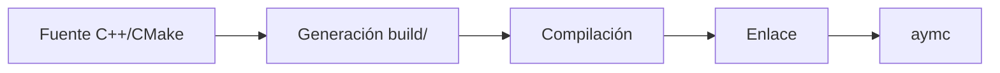

# Compilación e instalación (guía unificada)

Esta guía consolida los pasos de compilación, empaquetado e instalación para
AymaraLang.

## Requisitos

- **CMake** >= 3.15
- **Compilador C++17** (`g++`, `clang++` o MSVC)
- **NASM**
- **GCC/LD** (Linux) o **MinGW** (Windows)

## Build rápido con CMake (recomendado)

### Linux/macOS

```bash
cmake -S . -B build -DCMAKE_BUILD_TYPE=Release
cmake --build build -j
```

### Windows (MinGW)

```powershell
cmake -S . -B build -G "MinGW Makefiles" -DCMAKE_BUILD_TYPE=Release
cmake --build build -j
```

El binario queda en `build/bin/aymc` (o `build/bin/aymc.exe`).

### Flujo de build (resumen)



## Scripts de dependencias

- **Linux:** `scripts/install_deps_linux.sh` (apt/dnf/pacman).
- **Windows:** `scripts/install_deps_windows.ps1` (winget/choco/scoop).

## Empaquetado y distribuciones

### Windows (dist + instaladores)

```powershell
./scripts/build_dist.ps1 -Config Release
./scripts/build_msi.ps1
./scripts/build_nsis.ps1
```

Los instaladores quedan en `artifacts/`.

### Linux (`.deb`)

```bash
cmake -S . -B build -DCMAKE_BUILD_TYPE=Release
cmake --build build -j
cmake --install build --prefix dist
bash scripts/build_deb.sh
```

## Notas

- El runtime debe acompañar a `aymc` para compilar programas (carpeta `runtime/`).
- **Alternativas legacy:** `make` (Linux) y `build.bat` (Windows).

---

**Siguiente:** [CLI del compilador](compiler.md)
