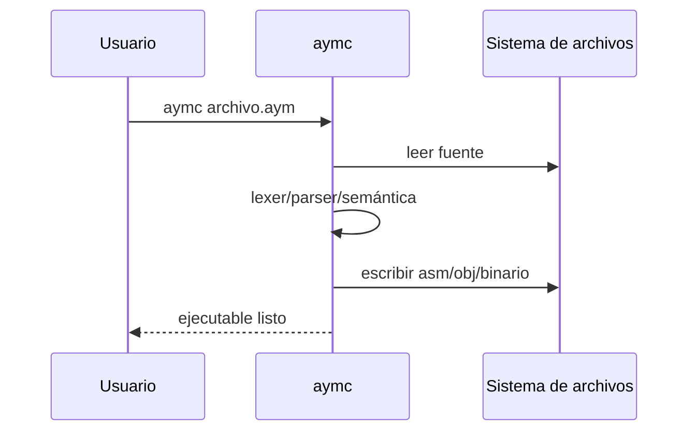

# CLI del compilador

`aymc` compila archivos `.aym` a ejecutables nativos. Por defecto genera el
binario junto al archivo de entrada.

## Uso básico

```bash
aymc archivo.aym
```

Si se entregan varios archivos, se concatenan en una sola unidad de compilación.



## Opciones principales

- `-o <ruta>`: nombre/salida del ejecutable.
- `--debug`: imprime tokens en consola.
- `--dump-ast`: imprime el total de nodos del AST.
- `--windows` / `--linux`: fuerza plataforma de salida.
- `--seed <valor>`: fija la semilla del generador pseudoaleatorio.
- `--llvm`: genera `output.ll` (requiere compilar con soporte LLVM).

## Archivos generados

- `output.asm`: código NASM (temporal, según plataforma).
- `output.o` / `output.obj`: objeto intermedio.
- `output` / `output.exe`: ejecutable final.

## Resolución de módulos

La sentencia `apnaq("ruta")` busca módulos en:

1. El directorio del archivo principal.
2. Una carpeta `modules/` dentro de ese directorio.
3. Rutas adicionales definidas en la variable de entorno `AYM_PATH`.

---

**Siguiente:** [Arquitectura del compilador](arquitectura.md)
