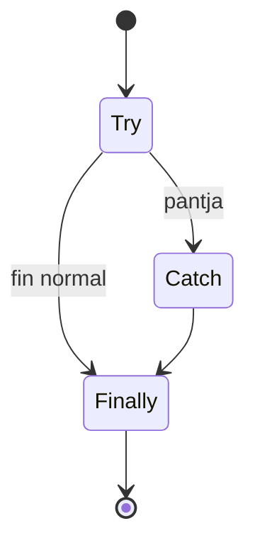

# Manejo de errores

AymaraLang soporta `try/catch/finally` con palabras clave en aymara.

## Sintaxis base

```aymara
yant'aña {
    // código que puede fallar
} katjaña(e) {
    // manejo de error
} tukuyawi {
    // se ejecuta siempre
}
```



## Lanzar excepciones

```aymara
pantja("TIPO", "mensaje");
```

## Ejemplo mínimo

```aymara
yant'aña {
    pantja("CONVERSION", "dato inválido");
} katjaña("CONVERSION", e) {
    qillqa(e.suti);
    qillqa(e.aru);
}
```

---

**Siguiente:** [Gramática formal](grammar.md)
