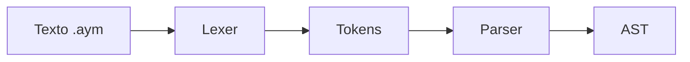

# Gramática de AymaraLang (AruQillqa)

Este documento describe la gramática actual del lenguaje AymaraLang utilizando
notación EBNF y resume los tokens reconocidos por el compilador. Las reglas de
tokenización están implementadas en `compiler/lexer/lexer.cpp`.

## Tokens léxicos



### Palabras clave

| Token | Lexema(s) aceptado(s) | Uso sintáctico |
|-------|------------------------|----------------|
| `KeywordStart` | `qallta` | Inicio del programa |
| `KeywordEnd` | `tukuya` | Fin del programa |
| `KeywordDeclare` | `yatiya` | Declaración de variables |
| `KeywordPrint` | `qillqa` | Sentencia de impresión |
| `KeywordIf` | `suti`, `jisa` | Condicional |
| `KeywordElse` | `jani`, `maysatxa` | Rama alternativa |
| `KeywordWhile` | `kunawsati`, `ukhakamaxa` | Bucle `while` |
| `KeywordFor` | `sapüru`, `taki` | Bucle `for` |
| `KeywordBreak` | `p'akhiña` | Salir de un bucle |
| `KeywordContinue` | `sarantaña` | Continuar bucle |
| `KeywordFunc` | `lurawi` | Definición de funciones |
| `KeywordReturn` | `kuttaya` | Retorno |
| `KeywordImport` | `apnaq` | Importación |
| `KeywordTry` | `yant'aña` | Bloque `try` |
| `KeywordCatch` | `katjaña` | Bloque `catch` |
| `KeywordFinally` | `tukuyawi` | Bloque `finally` |
| `KeywordThrow` | `pantja` | Lanzar excepción |
| `KeywordClass` | `kasta` | Definición de clases |
| `KeywordNew` | `machaqa` | Crear instancia |
| `KeywordThis` | `aka` | Referencia al objeto actual |
| `KeywordExtends` | `jila` | Herencia |
| `KeywordOverride` | `jikxata` | Sobrescribir método |
| `KeywordPrivate` | `sapa` | Modificador privado |
| `KeywordPublic` | `taqi` | Modificador público |
| `KeywordStatic` | `sapakasta` | Modificador estático |
| `KeywordGetter` | `uñt'aya` | Nombre reservado para getter |
| `KeywordSetter` | `chura` | Nombre reservado para setter |
| `KeywordSuper` | `jilaaka` | Referencia al padre |
| `KeywordTypeNumber` | `jakhüwi` | Tipo numérico |
| `KeywordTypeString` | `aru` | Tipo cadena |
| `KeywordTypeBool` | `chiqa` | Tipo booleano |
| `KeywordTypeList` | `listaña`, `t'aqa` | Tipo lista |
| `KeywordTypeMap` | `mapa` | Tipo mapa (Español) |
| `KeywordTrue` | `utji`, `chiqa` | Literal verdadero |
| `KeywordFalse` | `janiutji`, `k'ari` | Literal falso |

### Operadores y delimitadores

Los símbolos se mantienen sin cambios:

- Agrupación: `()`, `{}`, `[]`
- Fin de sentencia: `;`
- Separador: `,`
- Asignación: `=`
- Dos puntos: `:`
- Operadores: `+ - * / % ^`
- Comparación: `== != < <= > >=`
- Lógicos: `&& || !`
- Comentarios: `//` y `/* */`

### Literales

- `Number`: números enteros decimales con soporte `0x` y `0b`.
- `String`: cadenas entre comillas dobles o simples con escapes (`\n`, `\t`, `\"`, `\'`, etc.).

## Notación EBNF utilizada

- `a*` indica repetición de cero o más veces.
- `a+` indica una o más repeticiones.
- `[a]` marca un elemento opcional.
- `a | b` representa alternativas.

## Gramática sintáctica

```ebnf
programa      = [ "qallta" ] { sentencia } [ "tukuya" ] ;

sentencia     = decl | asigna | if | while | for | func_def | class_def
              | retorno | salida | continuar | imprimir | importar
              | try | throw | bloque | ";" ;

bloque        = "{" { sentencia } "}" ;

decl          = "yatiya" tipo id [ "=" expr ] ";" ;

tipo          = "jakhüwi" | "aru" | "chiqa" | "listaña" | "t'aqa" | "mapa" | id ;

asigna        = id "=" expr ";" ;

if            = ("suti" | "jisa") "(" cond ")" bloque [ ("jani" | "maysatxa") bloque ] ;

while         = ("kunawsati" | "ukhakamaxa") "(" cond ")" bloque ;

for           = ("sapüru" | "taki") "(" [decl|asigna] ";" [cond] ";" [asigna_np] ")" bloque ;
asigna_np     = id "=" expr ;

func_def      = "lurawi" id "(" [ params ] ")" [ ":" tipo ] bloque ;
params        = param { "," param } ;
param         = tipo id ;

class_def     = "kasta" id [ "jila" id ] "{" { class_member } "}" ;
class_member  = { modificador } ( decl | metodo | ctor ) ;
modificador   = "sapa" | "taqi" | "sapakasta" | "jikxata" ;
metodo        = "lurawi" id "(" [ params ] ")" [ ":" tipo ] bloque ;
ctor          = "qallta" "(" [ params ] ")" bloque ;

retorno       = "kuttaya" [ expr ] ";" ;
salida        = "p'akhiña" ";" ;
continuar     = "sarantaña" ";" ;
throw         = "pantja" "(" (str | id) [ "," str ] ")" ";" ;
try           = "yant'aña" bloque { catch } [ finally ] ;
catch         = "katjaña" "(" [ str "," ] id ")" bloque ;
finally       = "tukuyawi" bloque ;

imprimir      = "qillqa" "(" [ args ] ")" ";" ;
importar      = "apnaq" "(" str ")" ";" ;

args          = expr { "," expr } ;

cond          = expr ;

expr          = or ;

or            = and { "||" and } ;
and           = igualdad { "&&" igualdad } ;

igualdad      = rel { ("==" | "!=") rel } ;
rel           = suma { ("<" | "<=" | ">" | ">=") suma } ;
suma          = multi { ("+" | "-") multi } ;
multi         = unario { ("*" | "/" | "%") unario } ;

unario        = [ "!" | "-" ] primario ;

primario      = num | str | ("utji" | "chiqa") | ("janiutji" | "k'ari")
              | "machaqa" id "(" [ args ] ")" | "aka" | "jilaaka"
              | id | llamada | "(" expr ")" | lista ;

llamada       = id "(" [ args ] ")" ;

lista         = "[" [ args ] "]" ;

id            = letra { letra | num | "_" } ;
num           = digito { digito } ;
str           = '\"' { caracter } '\"' | \"'\" { caracter } \"'\" ;
```

---

**Anterior:** [Referencia del lenguaje](aymaraLang.md) | **Siguiente:** [Arquitectura del compilador](arquitectura.md)
