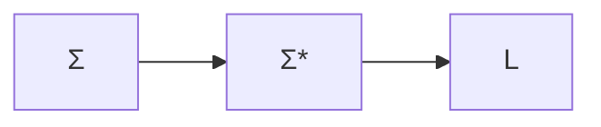
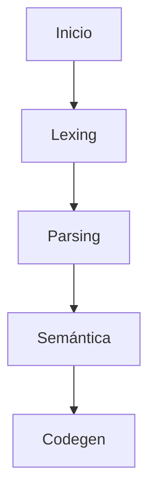
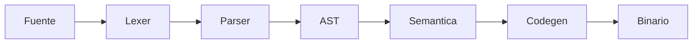
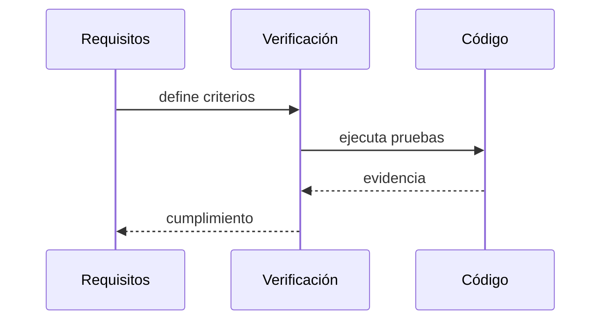

# Investigación y teoría

Esta sección resume fundamentos matemáticos y de compiladores que sustentan el
proyecto y su documentación de ingeniería.

## Matemática discreta

### Conjuntos y relaciones

Un lenguaje formal puede definirse como un conjunto de cadenas:

$$L \subseteq \Sigma^*$$

donde $\Sigma$ es el alfabeto y $\Sigma^*$ el conjunto de todas las cadenas.

### Grafos

Un grafo dirigido se representa como $G = (V, E)$ con $E \subseteq V \times V$.
Esto es útil para describir grafos de flujo de control y dependencias.

## Teoría de compiladores

### Fases clásicas

### Gramáticas y lenguajes

Una gramática libre de contexto se define como:

$$G = (N, \Sigma, P, S)$$

- $N$: no terminales
- $\Sigma$: terminales
- $P$: producciones
- $S$: símbolo inicial

### Complejidad

Para un parser LL sin retroceso, el costo total suele ser lineal en el número
de tokens $n$:

$$T(n) = O(n)$$

## Matemática aplicada al runtime

La generación de números pseudoaleatorios utiliza una semilla $s$ que permite
reproducibilidad. Si se define $x_{k+1} = f(x_k)$, el estado del generador es una
sucesión determinista dada la semilla inicial.

!!! note "Aplicación"
    La opción `--seed` fija $s$ para reproducir resultados en pruebas.

## Compiladores y verificación

