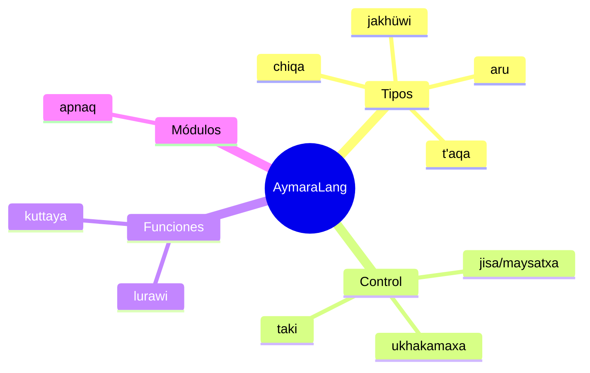

# Primeros pasos con AymaraLang

Ejemplos mínimos para escribir tus primeros programas.

## Hola mundo

```aymara
qillqa("Kamisaraki!");
```

## Tipos y variables

```aymara
yatiya jakhüwi contador = 3;
yatiya aru saludo = "kamisaraki";
yatiya chiqa activo = chiqa;
```



## Control de flujo

```aymara
jisa (contador > 0) {
    qillqa(saludo);
} maysatxa {
    qillqa("janiwa");
}

ukhakamaxa (contador > 0) {
    contador--;
}

taki (yatiya jakhüwi i = 0; i < 3; i++) {
    qillqa(i);
}
```

## Funciones

```aymara
lurawi inc(jakhüwi n) : jakhüwi {
    kuttaya n + 1;
}

qillqa(inc(5));
```

## Notas matemáticas rápidas

La longitud de una lista $L$ se expresa como $|L|$ y se obtiene con `largo` o
`suyut`.

## Módulos

```aymara
apnaq("modules/aritmetica");
qillqa("suma: " + suma(3, 4));
```

## Comentarios

```aymara
// comentario de línea
/* comentario de bloque */
```

## Palabras clave legacy

Se mantiene compatibilidad con las formas `suti`/`jani`, `kunawsati`, `sapüru`
y `utji`/`janiutji`.

---

**Siguiente:** [Referencia rápida](aymaraLang.md)
