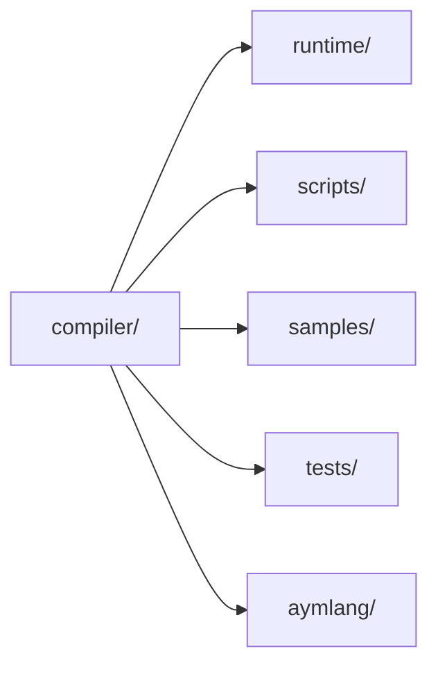

# Guía del proyecto

## Tecnologías y herramientas

- **Lenguaje:** C++17
- **Assembler:** NASM
- **Enlace:** GCC/LD (Linux) o MinGW (Windows)
- **Build:** CMake (principal), `make`/`build.bat` (legacy)
- **Extensión de VS Code:** `aymlang/`
- **Tests:** carpeta `tests/`

## Extensión para Visual Studio Code

La extensión vive en `aymlang/` y ofrece resaltado y snippets. Para empaquetar
un `.vsix`:

```bash
cd aymlang
npm install
npx @vscode/vsce package
```

Luego instala el `.vsix` desde VS Code (**Extensions → Install from VSIX**).

## Documentación y materiales de investigación

- Sitio MkDocs en `docs/`.
- Ingeniería de sistemas en `docs/systems_engineering/`.
- Fuentes LaTeX/Overleaf en `docs/systems_engineering/overleaf/`.

## Estructura del repositorio (resumen)

```
compiler/   # compilador C++
runtime/    # runtime estándar
aymlang/    # extensión VS Code
scripts/    # automatizaciones de build/packaging
samples/    # ejemplos .aym
tests/      # pruebas automatizadas
```


