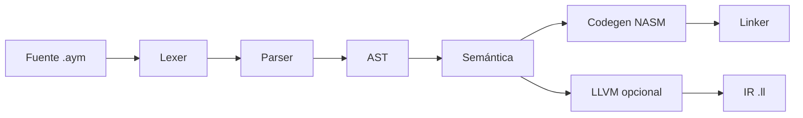

# Descripción de Arquitectura del Sistema

## 1. Visión general

AymaraLang está compuesto por un compilador modular (`aymc`), un runtime mínimo y
herramientas de apoyo. La arquitectura sigue el flujo clásico de compiladores
con módulos desacoplados.

## 2. Arquitectura funcional

| Módulo | Responsabilidad | Entradas | Salidas |
|---|---|---|---|
| Lexer | Tokenización de código fuente | `.aym` | Tokens |
| Parser | Construcción de AST | Tokens | AST |
| Semantic | Análisis semántico y tipos | AST | AST validado + símbolos |
| Codegen | Generación de NASM/LLVM | AST validado | `.asm`/`.ll` |
| Linker | Ensamblado/enlace | `.asm` | Binario |

## 3. Arquitectura física (deployment)

- **Entorno local:** Linux/Windows.
- **Dependencias:** NASM, GCC/LD o MinGW, compilador C++17.
- **Artefactos:** `.asm`, `.ll`, binario nativo, logs de error.

## 4. Interfaces clave

- **CLI:** `aymc [opciones] archivo.aym`.
- **Sistema de archivos:** lectura de fuentes, escritura de artefactos.
- **Runtime:** funciones básicas de E/S utilizadas por el ejecutable.

## 5. Datos e información

- **Tokens:** tipo, texto, línea y columna.
- **AST:** nodos de expresiones y sentencias.
- **Símbolos:** tablas de alcance para variables y funciones.

## 6. Restricciones de diseño

- C++17 como estándar base.
- Codegen x86_64 (NASM) como backend principal.
- LLVM como backend opcional.
