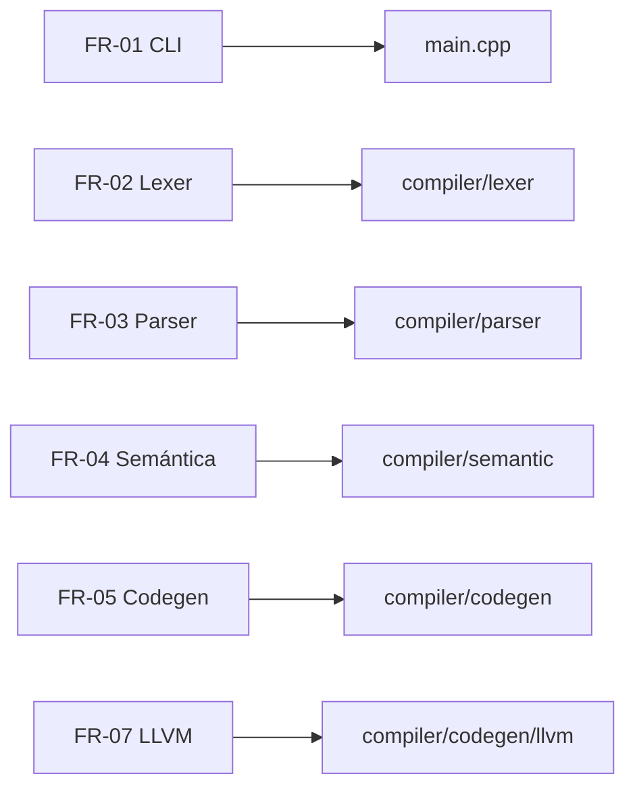

# Especificación de requisitos y documentación de ingeniería de sistemas (SEBOK/INCOSE)

> Basado en prácticas de SEBOK e INCOSE para captura de requisitos, definición de sistema y verificación.

## 1. Propósito
Definir los requisitos del sistema **AymaraLang (aym)** y su compilador **aymc**, así como el contexto operativo, stakeholders, interfaces, restricciones y criterios de verificación, utilizando una estructura compatible con SEBOK/INCOSE.

## 2. Alcance del sistema
**Sistema bajo estudio (SoS):**
- Compilador `aymc` (C++17) y backend de generación de ejecutables.
- Lenguaje AymaraLang (archivos fuente `.aym`).
- Runtime mínimo para E/S y utilidades estándar.

**Fuera de alcance:**
- IDEs o extensiones de editor.
- Librerías estándar externas adicionales.
- Integración con servicios en la nube.

## 3. Stakeholders y necesidades
| Stakeholder | Necesidad/objetivo | Prioridad |
|---|---|---|
| Docentes y estudiantes | Lenguaje accesible y representativo del aymara | Alta |
| Desarrolladores del compilador | Arquitectura modular y mantenible | Alta |
| Usuarios finales | Ejecutables nativos rápidos | Alta |
| Comunidad cultural | Preservación lingüística y material educativo | Media |

## 4. Concepto de operaciones (ConOps)
1. El usuario escribe código `.aym` con sintaxis en aymara.
2. Ejecuta `aymc` para compilar a un binario nativo (`.ayn` o `.exe`).
3. El compilador realiza: lexer → parser → AST → análisis semántico → codegen → ensamblado/enlace.
4. El ejecutable resultante corre en el sistema objetivo.

## 5. Contexto del sistema y límites
**Entorno operativo:**
- Sistemas Linux/Windows (con soporte de toolchain para NASM/LD/GCC o MinGW).
- Dependencias de compilación: `g++`/`clang++`, `nasm`, `gcc/ld`.

**Interfaces externas clave:**
- CLI del compilador (`aymc`).
- Sistema de archivos (lectura `.aym`, escritura `.asm`/`.ll` y binarios).
- Backend LLVM (opcional, activado con `--llvm`).

## 6. Arquitectura funcional (resumen)
| Función | Entrada | Salida |
|---|---|---|
| Análisis léxico | Código `.aym` | Tokens |
| Análisis sintáctico | Tokens | AST |
| Análisis semántico | AST | AST validado + símbolos |
| Generación de código | AST validado | `.asm`/`.ll` |
| Ensamblado/enlace | `.asm` | Binario nativo |

## 7. Requisitos del sistema

### 7.1 Requisitos funcionales (FR)
**FR-01** El sistema debe aceptar uno o más archivos `.aym` como entrada por CLI.

**FR-02** El sistema debe tokenizar el código fuente y producir tokens conforme a palabras clave y símbolos del lenguaje.

**FR-03** El sistema debe generar un AST válido mediante análisis sintáctico LL.

**FR-04** El sistema debe validar semántica (tipado, símbolos y llamadas) antes de generar código.

**FR-05** El sistema debe generar ensamblador NASM x86_64 y enlazar un ejecutable nativo.

**FR-06** El sistema debe permitir seleccionar objetivo Linux o Windows desde la CLI.

**FR-07** El sistema debe admitir un backend LLVM experimental que genere `.ll`.

**FR-08** El sistema debe soportar módulos importados desde archivos externos.

**FR-09** El sistema debe incluir funciones integradas (E/S, matemáticas, arreglos, aleatoriedad).

### 7.2 Requisitos no funcionales (NFR)
**NFR-01** El compilador debe ejecutarse en Linux y Windows con toolchain estándar.

**NFR-02** El tiempo de compilación debe ser adecuado para programas educativos (<= 2s para archivos pequeños en equipos de clase).

**NFR-03** El sistema debe proporcionar mensajes de error legibles para errores léxicos, sintácticos y semánticos.

**NFR-04** El código debe mantener una estructura modular (lexer/parser/ast/semantic/codegen).

**NFR-05** El proyecto debe compilarse con C++17.

### 7.3 Requisitos de interfaz (IR)
**IR-01** CLI principal: `aymc [opciones] archivo.aym ...`.

**IR-02** Opciones: `--debug`, `--dump-ast`, `--seed`, `--llvm`, `--windows`, `--linux`, `-o`.

**IR-03** Archivos de salida: `.asm` (NASM), `.ll` (LLVM), y ejecutable nativo.

## 8. Restricciones y supuestos
- Se requiere toolchain (NASM y GCC/LD o MinGW) disponible en PATH.
- El backend LLVM es opcional y depende de compilación con soporte.
- El lenguaje está orientado a tipado estático y a constructs definidos en la gramática.

## 9. Verificación y validación (V&V)
| Requisito | Método | Evidencia esperada |
|---|---|---|
| FR-01 | Inspección/Prueba | `aymc archivo.aym` compila sin errores |
| FR-05 | Prueba | Se genera `.asm` y binario ejecutable |
| FR-07 | Prueba | Se genera archivo `.ll` |
| NFR-05 | Inspección | Uso de `-std=c++17` en build |

## 10. Trazabilidad (resumen)
| Requisito | Elemento de diseño | Evidencia técnica |
|---|---|---|
| FR-01 | CLI `main.cpp` | Parsing de argumentos |
| FR-02 | `lexer/` | Tokenización |
| FR-03 | `parser/` | Construcción de AST |
| FR-04 | `semantic/` | Análisis de tipos |
| FR-05 | `codegen/` | Generación NASM |
| FR-07 | `codegen/llvm/` | LLVM IR |
| FR-08 | `module_resolver` | Resolución de módulos |
| FR-09 | `builtins/` | Funciones integradas |

## 11. Riesgos técnicos (alto nivel)
- Dependencia de toolchain externo para ensamblado/enlace.
- Backend LLVM incompleto o experimental.
- Compatibilidad limitada con arquitecturas distintas de x86_64.

## 12. Glosario
- **AST:** Árbol de Sintaxis Abstracta.
- **V&V:** Verificación y validación.
- **ConOps:** Concepto de operaciones.
