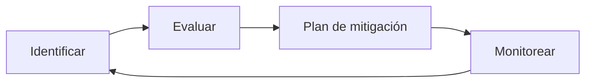

# Plan de Gestión de Riesgos

## 1. Objetivo
Identificar, evaluar y mitigar riesgos técnicos y de proyecto asociados al desarrollo y uso de AymaraLang.

## 2. Metodología
- Identificación de riesgos.
- Evaluación de probabilidad e impacto.
- Planes de mitigación y contingencia.

## 3. Registro de riesgos
| ID | Riesgo | Probabilidad | Impacto | Mitigación |
|---|---|---|---|---|
| R-01 | Dependencia de toolchain externo | Media | Alta | Documentar dependencias y validar en CI | 
| R-02 | Backend LLVM incompleto | Media | Media | Mantener backend NASM como principal |
| R-03 | Compatibilidad limitada a x86_64 | Alta | Media | Definir roadmap multi-arquitectura |
| R-04 | Curva de aprendizaje de sintaxis aymara | Media | Media | Crear guías y ejemplos accesibles |
| R-05 | Falta de recursos para pruebas en Windows | Media | Media | Automatizar tests y usar runners multi-OS |

## 4. Monitoreo
- Revisiones trimestrales del registro de riesgos.
- Seguimiento de issues en GitHub.
