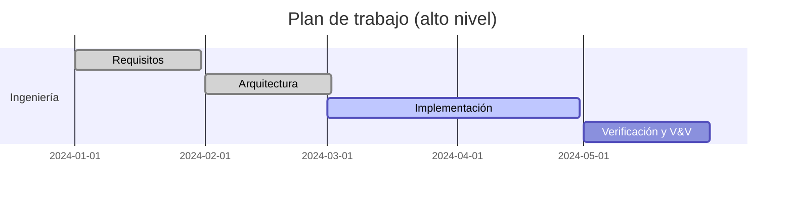

# Plan de Gestión de Ingeniería de Sistemas (SEMP)

## 1. Objetivo
Establecer la estrategia, procesos y entregables de ingeniería de sistemas para AymaraLang.

## 2. Alcance
- Definición de requisitos (SRD).
- Arquitectura y diseño.
- Verificación y validación.
- Gestión de configuración y riesgos.

## 3. Procesos principales
| Proceso | Actividades |
|---|---|
| Requisitos | Captura, análisis, trazabilidad |
| Arquitectura | Definición modular y interfaces |
| Implementación | Desarrollo iterativo en C++17 |
| V&V | Pruebas, inspecciones, demostraciones |
| Gestión de cambios | Git + revisión por PR |

## 4. Entregables
- Especificación de requisitos.
- ConOps.
- Documento de arquitectura.
- ICD.
- Plan de V&V.
- Registro de riesgos.

## 5. Gestión de configuración
- Repositorio Git como fuente única.
- Versionado semántico para releases.
- Control de cambios vía PR.

## 6. Métricas
- Porcentaje de requisitos verificados.
- Cobertura de pruebas en `tests/`.
- Tiempo promedio de compilación.
